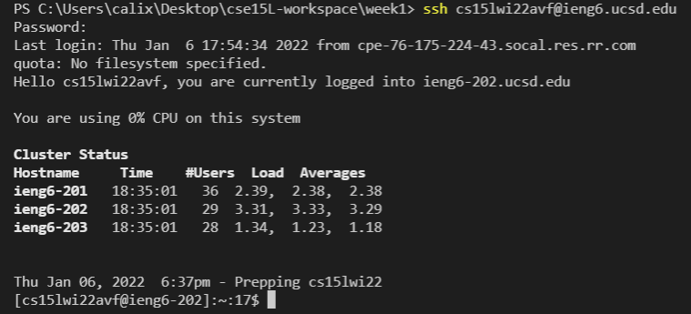
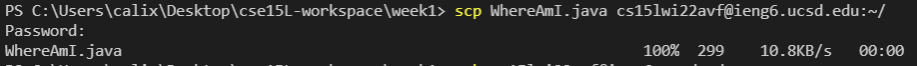
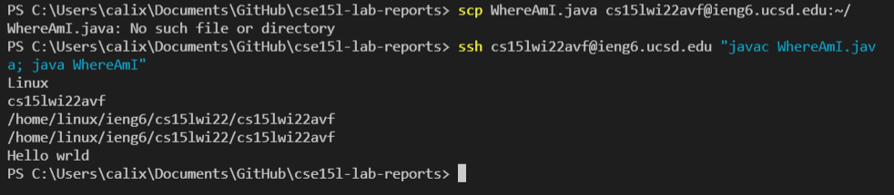

### Installing VS Code

Visit [VS Code](https://code.visualstudio.com/) and install the latest version of VSCode.

If you're on Windows, your VS code should look similar to mine.

--- 
### Remotely Connecting 
Follow the steps to [Install OpenSSH](https://docs.microsoft.com/en-us/windows-server/administration/openssh/openssh_install_firstuse)

Find your login [here](https://sdacs.ucsd.edu/~icc/index.php)

type the command:
*ssh cs15lwi22zzz@ieng6.ucsd.edu*

where zzz is replaced by your three characters

---
### Trying Some Commands 
try any of the following commands:
- cd
- cd ~
- ls -lat
- ls -a
- ls <directory>
- mkdir <directory_name>
- cat /home/linux/ieng6/cs15lwi22/public/hello.txt 

The output should look something like this if you ran similar commands

---

### Moving Files with scp 

To move files from our local to the remote, we use scp.
Simply, type the following command to copy WhereAmI.java on the remote:
*scp WhereAmI.java cs15lwi22zz@ieng6.ucsd.edu:~/*

When your file has transferred it should look like this.

---
### Setting an SSH Key 
On your local machine, run the following command:
*ssh-keygen*

- When promoted for a file location just press enter for the default location. 
- When prompted for a passphrase enter any you'd like. 

On the remote create a new directory called ".ssh" by running: 
*mkdir .ssh*

Back on your local machine, scp your public key file by typing the following command: 
*scp /Users/User/.ssh/id_rsa.pub cs15lwi22zzz@ieng6.ucsd.edu:~/.ssh/authorized_keys* 

Where User is repalced by your User and zzz is replaced by your login. A successful file transfer should look like this.

You now should be able to login to SSH **WITHOUT** need of typing in your password. 

---
### Optimizing Remote Running
To simplify the remote running process here are some tips: 
- You can login and run commands in the remote at once. By doing the following: Running ssh command and then your command like "ls"  

- You can run multiple commands at once by comma separating them.

- Using the up-arrow can save time by returning the previously ran command

     - Doing so we can reduce the amount of key strokes it takes to make a local change to our file, scp it over to host, and run the file at the host.

    -  This should take about 5 key strokes in total. Up and Enter to Scp our file. Up, Up and Enter to connect to host and run our file. This would look like the following:
    
